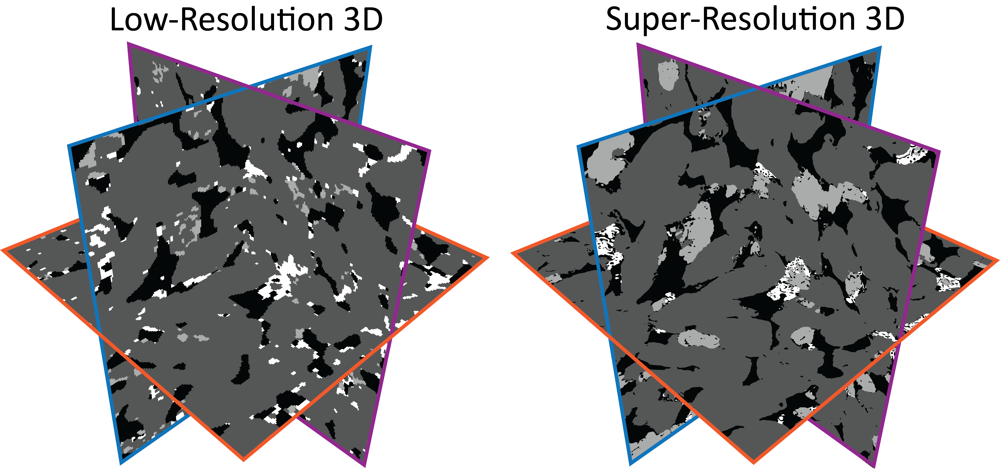
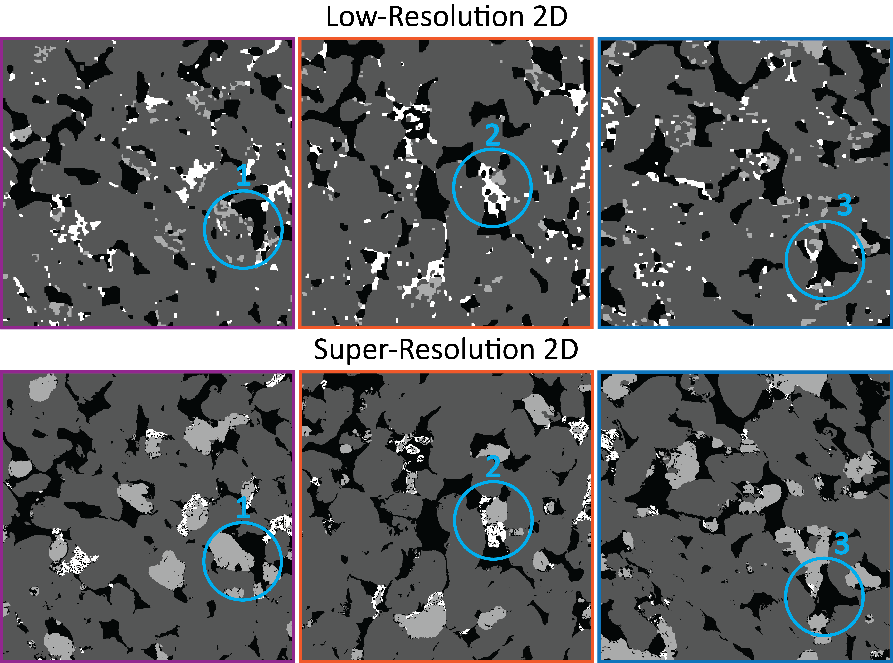
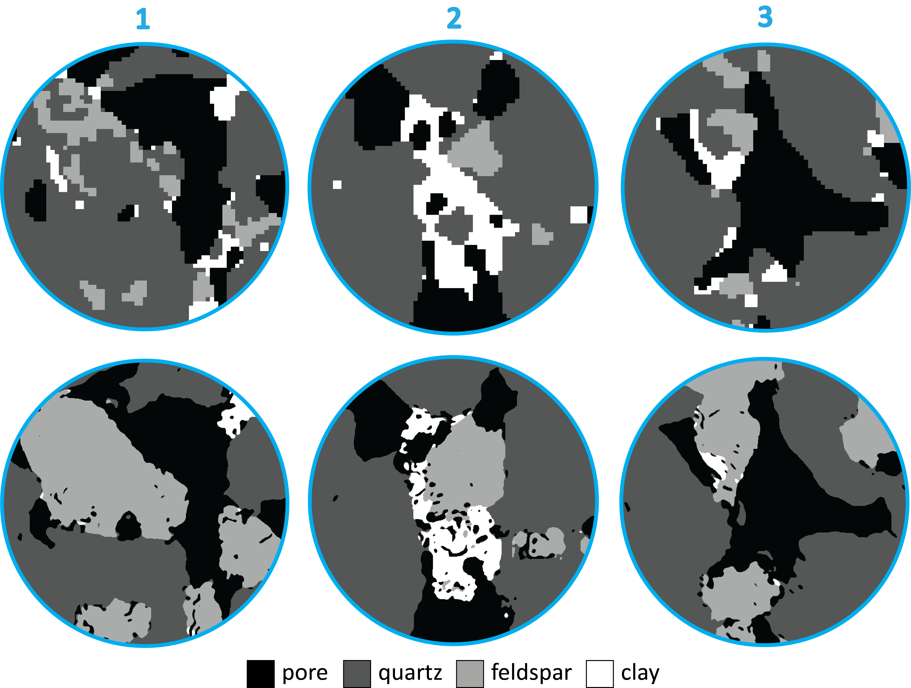

# Important  
Credits for developing the algorithm and providing the code go to the Amir Dahari, Steve Kench, Isaac Squires, and Samuel J. Cooper from the Dyson School 
of Design Engineering, Imperial College London    

Their publication in Advanced Energy Materials: https://onlinelibrary.wiley.com/doi/epdf/10.1002/aenm.202202407     
Their main repository can be found in https://github.com/tldr-group/SuperRes at https://github.com/tldr-group/SuperRes

# Contribution
Our modifications to the code include:
 1. Increasing Generator and Discriminator Networks
 2. Training on larger sub-volumes due to the nature of rock materials (larger grains require large images)
 3. Distributing the Generator model into 3 GPUs with the Distributed Data Parallel functionality
 4. Minor refinements and additional comments regarding the functionality

Our main contribution is the adjustment of the 8x Super-Resolution algorithm for the segmented 3D micro-CT images of rocks. In this example, we prepared the training dataset and tuned the model for Berea sandstone. Below, we demonstrate the performance of the model. As input, we took the Low-Resolution image, and as output, we produced Super-Resolution image.

  



All details are provided in the attached paper.

# Implementation details 
1. In this work, the 3D Generator was trained with the Distributed Pipeline Parallel (DPP) functionality. This way, the 3D Generator model was distributed into three A100 GPUs. Such modification allowed us to experiment with inputs of size 64^3 voxels and outputs of size 512^3 (8x times larger). However, in this case, even with DPP we had to significantly reduce the number of parameters in the Generator model.
Even though in this particular example we finished with inputs of size 32^3 voxels, some types of rocks may require inputs of larger size. 
To use DPP, keep the ```--DPP``` as ```True```.

2. If you are limited with the number of available GPUs, or if your don't need DPP for training, keep the ```--DPP``` as ```False```. In this case, you may experience the Out Of Memory (OOM) error. The easiest way to avoid it is either to decrease the number of parameters (channels) in the Generator, either to reduce the input size of the 3D LR segmented sub-volume (managed in the BatchMaker.py). 
However, it is crusual to use the sub-volumes of size large enough to contain at least two different grains (and their contact). To use ```--DPP``` as ```False```, your model should fit into single GPU for a particular batch size. In this case, if you have several available GPUs, you can run training with Distributed Data Parallel (DDP). To do so, keep ```--DDP ```as ```True``` and ```--DPP ```as ```False```.  

4. As Low-Resolution input, the algorithm uses 3D .tiff files. As High-Resolution ground truth, the algorithm uses a stack of 2D images, also in the .tiff format. Each value in these images represent a particular phase. In this example, we have an equal number of phases in Low-Resolution and High-Resolution images. However, the number of phases in High-Resolution dataset can be more (but not less) than in Low-Resolution dataset. In this case, the algorithm will try to insert the missing phases based on the High-Resolution example.    

5. Keep 3D Low-Resolution and 2D High-Resolution datasets in the  folder.    

6. This approach is not a magic wand. Using the presented algorithm for different materials in different resolutions requires individual tuning (sometimes significant) of input size and model size to manage memory requirements and generating performance.

# Environment  
For convenience, you may use the provided ```environment.yml``` file as follow:  
1. Create a new environment from the .yml file:
```
conda env create -f environment.yml
```
2. Activate the new environment once it’s created:
```
conda activate environment
```

# Training
The training can be launched from the  fodler with the following command:

```
torchrun Architecture_PIPE.py -d 8x_Super-Resolution --with_rotation -phases_idx 1 2 3 -g_image_path Berea_CT_full.tiff -d_image_path Berea_CSLM_clay_gen.tif --DPP True --DDP False
```
where  

```-d``` The name of the directory to save the Generator in, under the 'progress' directory,     

```--with_rotation``` Use this option for data augmentaion (rotations and mirrors) of the High-Resolution input,      

```-phases_idx``` The indices of the phases of the Low-Resolution input to be compared with the Super-Resolution output,    

```-g_image_path``` Relative path to the Low-Resolution 3D volume inside ,    

```-d_image_path``` Relative path to the High-Resolution 2D slice inside ,    

```--DPP``` The flag to turn on/off the Distributed Pipeline Parallel (DPP),    

```--DDP``` The flag to turn on/off the Distributed Data Parallel (DDP);    

# Evaluation  
To use the pre-trained Generator for processing Low-Resolution image, launch the following command from the  folder 

```
torchrun Evaluation.py -d 8x_Super-Resolution -volume_size_to_evaluate 256 256 256 -g_image_path small.tif -n_phases 4 --DPP True
```
where  

```-d``` The name of the directory under the 'progress' directory where the pre-trained Generator parameters were saved,    
 
```-volume_size_to_evaluate``` The size of the Low-Resolution volume to be Super-Resolved,    

```-g_image_path``` Relative path to the Low-Resolution image to Super-Resolve inside ,    

```-n_phases``` The number of phases in High-Resolution dataset,    

```--DPP``` The flag indicating if the Distributed Pipeline Parallel (DPP) was used for training;   
